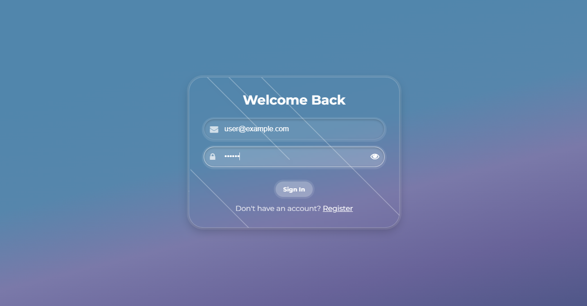
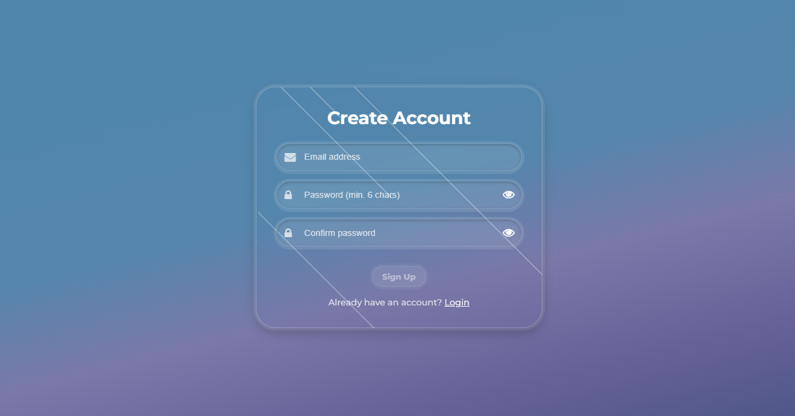
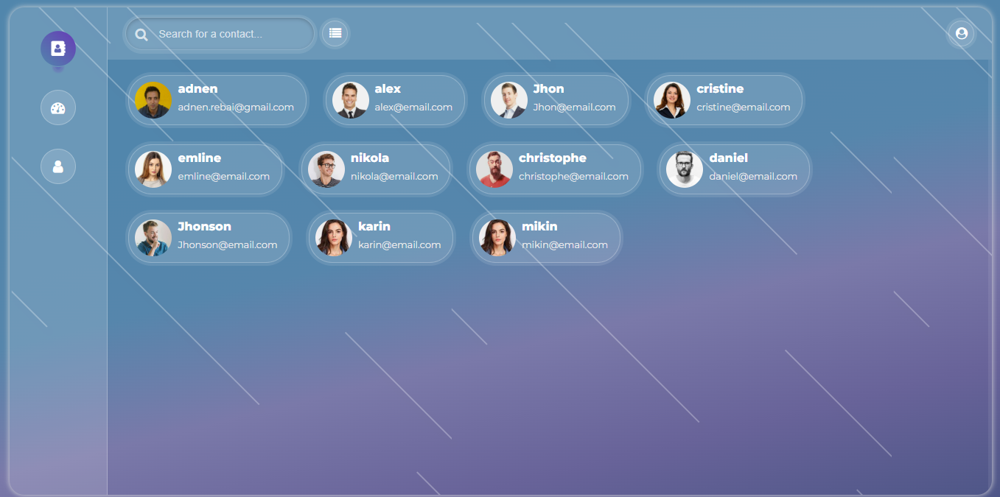

# 📇 Managing Contacts - Angular

A modern contact management web application built with **Angular 21**.  
Users can register, log in, and manage their personal contacts through a clean, responsive interface.


[Managing Contacts Angular](https://adnenre.github.io/managing-contacts-angular/)

---

## 🚀 Live Demo

👉 [**https://adnenre.github.io/managing-contacts-angular/**](https://adnenre.github.io/managing-contacts-angular/)

---

## ✨ Features

- [x] 🔐 **Authentication** – Register and login securely (demo users stored in localStorage)
- [x] 🎨 **Responsive UI** – Works on desktop, tablet, and mobile
- [x] ⚡ **Fast & modern** – Built with Angular standalone components & reactive forms
- [x] 📁 **Persistent storage** – Currently uses `localStorage` for demo/prototype (future: replace with a real backend)
- [x] 🧩 **Custom UI components** – No external UI library (Material, Bootstrap, etc.); all components (buttons, modals, inputs, tables) built from scratch
- [ ] 📞 **Contact Management** – Add, edit, delete, and list contacts

---

## 🖼️ Screenshots

### Login Screen



### Register Screen



### Contacts Screen



[](https://adnenre.github.io/managing-contacts-angular/)

This project was generated using [Angular CLI](https://github.com/angular/angular-cli) version 21.2.5.

## 🛠️ Tech Stack

| Technology            | Purpose                    |
| --------------------- | -------------------------- |
| Angular 21            | Frontend framework         |
| TypeScript            | Type-safe development      |
| Reactive Forms        | Form handling & validation |
| Angular Router        | Navigation & guards        |
| GitHub Pages          | Hosting & deployment       |
| `angular-cli-ghpages` | Deployment utility         |

## Development server

To start a local development server, run:

```bash
ng serve
```

Once the server is running, open your browser and navigate to `http://localhost:4200/`. The application will automatically reload whenever you modify any of the source files.

## Code scaffolding

Angular CLI includes powerful code scaffolding tools. To generate a new component, run:

```bash
ng generate component component-name
```

For a complete list of available schematics (such as `components`, `directives`, or `pipes`), run:

```bash
ng generate --help
```

## Building

To build the project run:

```bash
ng build
```

This will compile your project and store the build artifacts in the `dist/` directory. By default, the production build optimizes your application for performance and speed.

## Running unit tests

To execute unit tests with the [Vitest](https://vitest.dev/) test runner, use the following command:

```bash
ng test
```

## Running end-to-end tests

For end-to-end (e2e) testing, run:

```bash
ng e2e
```

Angular CLI does not come with an end-to-end testing framework by default. You can choose one that suits your needs.

## Additional Resources

For more information on using the Angular CLI, including detailed command references, visit the [Angular CLI Overview and Command Reference](https://angular.dev/tools/cli) page.
